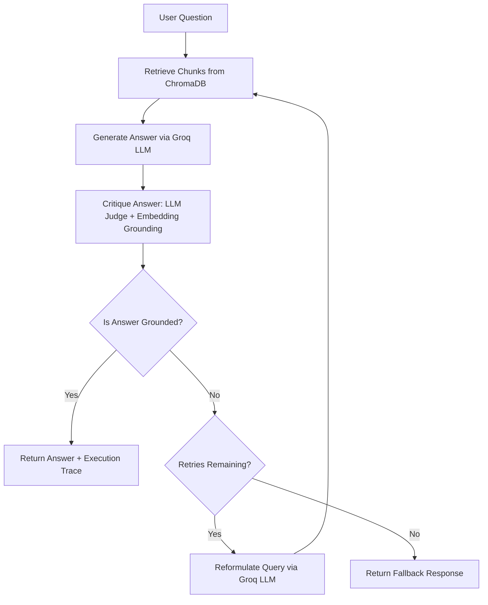

# 🔄 Self-Healing RAG Pipeline

[](https://self-healing-rag-jade.vercel.app/)
[](https://selfhealingrag-production-4084.up.railway.app/docs)
[](https://www.python.org/)
[](https://fastapi.tiangolo.com/)
[](https://groq.com/)
[](https://www.trychroma.com/)
[](LICENSE)

> An intelligent **Retrieval-Augmented Generation (RAG)** engine built with **FastAPI**, **Groq**, and **ChromaDB**. 
> Unlike standard RAG systems that blindly accept initial retrieval results, **Self-Healing RAG** self-critiques every generated answer for hallucination, dynamically reformulates failed queries, and retries retrieval before gracefully falling back to a safe answer.

- 🌐 **Live Web Application (Vercel)**: [https://self-healing-rag-jade.vercel.app/](https://self-healing-rag-jade.vercel.app/)
- ⚙️ **Live Backend API (Railway)**: [https://selfhealingrag-production-4084.up.railway.app/docs](https://selfhealingrag-production-4084.up.railway.app/docs)

---

## 🎯 Key Features

- 🔁 **Closed-Loop Self-Correction**: Automatically checks if generated responses are grounded in retrieved context.
- ⚖️ **Dual-Validation Critic**: Combines **LLM-as-a-Judge** verification with an **embedding-similarity grounding score** to detect subtle hallucinations.
- 🔍 **Dynamic Query Reformulation**: If the retrieved context is insufficient or leads to a hallucinated answer, the engine rewrites the query for a targeted second (or third) lookup attempt.
- 📊 **Full Attempt Traceability**: Returns step-by-step logs for every retrieval attempt, query reformulation, chunk score, and critique verdict in the API response.
- ⚡ **Lightning Fast Inference**: Powered by Groq's high-speed inference engine (`llama-3.3-70b-versatile`).
- 📈 **Built-in Evaluation Suite**: Includes evaluation scripts to benchmark hallucination rates and fallback accuracy on unanswerable questions.

---

## 🧠 Architecture & Workflow



### Feedback Loop Stages:
1. **Retrieve**: Embed query with `all-MiniLM-L6-v2` and fetch Top-$K$ chunks from ChromaDB.
2. **Generate**: Synthesize a concise answer strictly constrained by the retrieved context.
3. **Critique**: Compute dual faithfulness score (LLM assessment + cosine similarity grounding score).
4. **Self-Heal / Fallback**: Reformulate query if ungrounded, or return an honest fallback response when retries are exhausted.

---

## 🛠️ Technology Stack & Tradeoffs

| Layer | Technology | Rationale |
| :--- | :--- | :--- |
| **LLM Engine** | Groq (`llama-3.3-70b-versatile`) | Fast token generation speed, low latency for real-time critique loops. |
| **Embeddings** | `sentence-transformers/all-MiniLM-L6-v2` | Lightweight, CPU-friendly local embedding model with zero external API dependencies. |
| **Vector Store** | ChromaDB (Local Persistent) | Embedded, zero-maintenance vector store ideal for local development & deployment. |
| **API Framework**| FastAPI + Pydantic v2 | High performance, automatic OpenAPI interactive documentation, strict type validation. |
| **Critic Engine** | Hybrid (LLM Judge + Cosine Similarity) | Prevents single-point-of-failure LLM bias by combining non-deterministic and deterministic signals. |

---

## 📁 Project Structure

```text
self_healing_rag/
├── app/
│   ├── config.py          # Central configuration settings & tunables (.env integration)
│   ├── critic.py          # Hybrid faithfulness critic (LLM judge + embedding cosine distance)
│   ├── embeddings.py      # SentenceTransformers singleton wrapper
│   ├── ingestion.py       # Document extraction (.pdf, .txt, .md) & text chunker
│   ├── llm.py             # Groq LLM wrapper (generate, critique, reformulate)
│   ├── main.py            # FastAPI endpoints & application lifecycle
│   ├── models.py          # Pydantic schemas (requests, responses, attempt traces)
│   ├── pipeline.py        # Core Self-Healing RAG execution loop
│   └── vector_store.py    # Persistent ChromaDB client wrapper
├── eval/
│   ├── run_eval.py        # Benchmark suite (hallucination rate & fallback rate metrics)
│   └── sample_eval_set.json # Test queries containing both answerable & trick questions
├── .env.example           # Environment template
├── Dockerfile             # Container definition
├── requirements.txt       # Python dependencies (pinned for stability)
└── README.md              # Project documentation
```

---

## 🚀 Quickstart

### Prerequisites

- Python 3.10+
- Free Groq API Key ([Get one here](https://console.groq.com))

### Installation

1. **Clone the Repository**
   ```bash
   git clone https://github.com/your-username/self_healing_rag.git
   cd self_healing_rag
   ```

2. **Set Up Virtual Environment**
   ```bash
   python -m venv venv
   # On Linux/macOS:
   source venv/bin/activate
   # On Windows (PowerShell):
   .\venv\Scripts\Activate.ps1
   ```

3. **Install Dependencies**
   ```bash
   pip install -r requirements.txt
   ```

4. **Configure Environment Variables**
   ```bash
   cp .env.example .env
   ```
   Edit `.env` and set your `GROQ_API_KEY`:
   ```env
   GROQ_API_KEY=gsk_your_actual_api_key_here
   GROQ_GENERATION_MODEL=llama-3.3-70b-versatile
   GROQ_CRITIC_MODEL=llama-3.3-70b-versatile
   EMBEDDING_MODEL=all-MiniLM-L6-v2
   FAITHFULNESS_THRESHOLD=0.55
   MAX_RETRIES=2
   ```

---

## 🏃 Running the Application

### Local Development Server

```bash
uvicorn app.main:app --reload --port 8000
```

Once running, access:
- **API Documentation (Swagger UI)**: [http://127.0.0.1:8000/docs](http://127.0.0.1:8000/docs)
- **ReDoc Docs**: [http://127.0.0.1:8000/redoc](http://127.0.0.1:8000/redoc)

### Running with Docker

```bash
docker build -t self-healing-rag .
docker run -p 8000:8000 --env-file .env self-healing-rag
```

---

## 📡 API Reference

### 1. Ingest Document
Upload a `.pdf`, `.md`, or `.txt` file to build or append to a specific vector corpus.

- **Endpoint**: `POST /ingest`
- **Content-Type**: `multipart/form-data`

```bash
curl -X POST http://127.0.0.1:8000/ingest \
  -F "file=@/path/to/document.pdf" \
  -F "corpus_id=tech_docs"
```

**Response Example (`200 OK`)**:
```json
{
  "corpus_id": "tech_docs",
  "filename": "document.pdf",
  "num_chunks": 14,
  "message": "Ingested 14 chunks into corpus 'tech_docs'."
}
```

---

### 2. Query Corpus (Self-Healing Loop)
Execute the retrieve-generate-critique-retry pipeline against an ingested corpus.

- **Endpoint**: `POST /ask`
- **Content-Type**: `application/json`

```bash
curl -X POST http://127.0.0.1:8000/ask \
  -H "Content-Type: application/json" \
  -d '{
    "question": "What is the memory limit for worker threads?",
    "corpus_id": "tech_docs",
    "top_k": 4,
    "max_retries": 2
  }'
```

**Response Example (`200 OK`)**:
```json
{
  "question": "What is the memory limit for worker threads?",
  "final_answer": "The maximum memory allocation for worker threads is set to 512MB per instance.",
  "was_fallback": false,
  "attempts_made": 2,
  "attempts": [
    {
      "attempt_index": 1,
      "query_used": "What is the memory limit for worker threads?",
      "retrieved_chunks": [...],
      "generated_answer": "Worker threads can use unlimited memory up to system RAM.",
      "critique_verdict": "hallucinated",
      "combined_faithfulness_score": 0.42,
      "accepted": false,
      "rejection_reason": "Low combined faithfulness score (0.42 < 0.55 threshold)"
    },
    {
      "attempt_index": 2,
      "query_used": "worker thread memory allocation limit configuration",
      "retrieved_chunks": [...],
      "generated_answer": "The maximum memory allocation for worker threads is set to 512MB per instance.",
      "critique_verdict": "grounded",
      "combined_faithfulness_score": 0.94,
      "accepted": true
    }
  ]
}
```

---

## 📊 Evaluation & Benchmarking

The repository provides an evaluation framework (`eval/run_eval.py`) to measure system accuracy and hallucination prevention against a test dataset (`eval/sample_eval_set.json`).

Run evaluation against your corpus:
```bash
python eval/run_eval.py --corpus_id tech_docs --eval_file eval/sample_eval_set.json
```

**Metrics Collected**:
- 🎯 **Hallucination Rate on Unanswerable Queries**: Target = `0.0%`
- 🛡️ **Fallback Accuracy**: Target = `100.0%` for out-of-domain/unanswerable questions.
- 📈 **Average Faithfulness Score**: Average grounding score across accepted responses.
- 🔄 **Average Retries**: Average attempt count required before reaching a grounded answer.

---

## 📄 License

Distributed under the MIT License. See `LICENSE` for more information.